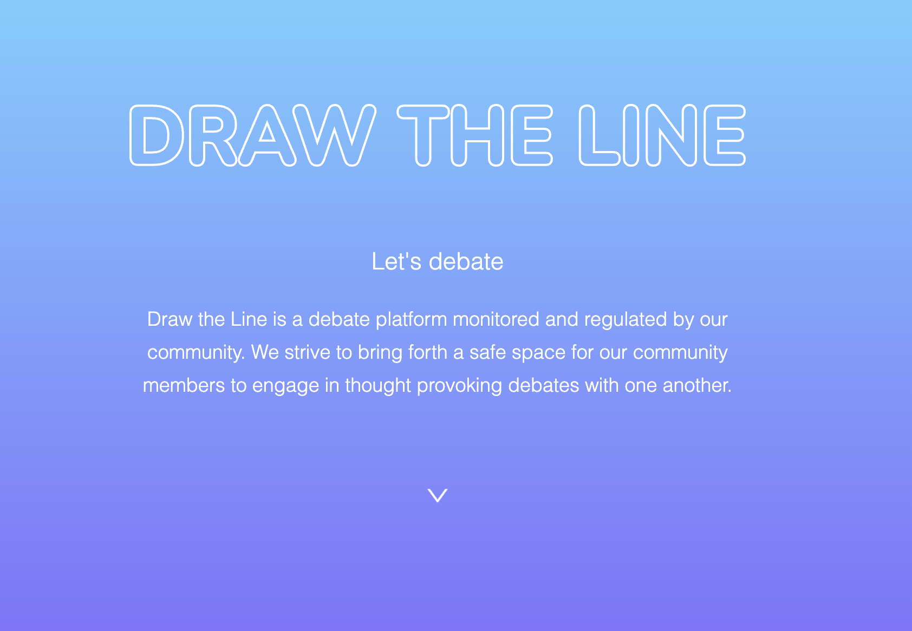

  # draw-the-line [](http://unlicense.org/)
  ## Description
  
  Draw the Line is a social media platform where users can post lengthy articles and users can comment to debate issues. This website has no administrators or monitors. The community of users will monitor itself. If you find something offensive, unconstructive, or just mean, downvote it. Once a comment’s or post’s downvote make up 60% of its overall likes and dislikes, poof! It’s gone. This is to eliminate the possibility of a noisy few distorting how the majority actually feel on a topic. We give the power back to the people and have faith that the majority will more accurately express a narrative that is representative of the general public. Draw the Line™ is an experiment in digital democracy.
  ## Tables of Contents
  1. [Installation](#installation)
  2. [Usage](#usage)
  3. [Contribution](#contribution)
  4. [Tests](#tests)
  5. [License](#license)
  6. [Questions](#questions)
  ## Installation
  To install the necessary dependencies, run the following command.
  ```
  npm i
  ```
  ## Usage
  NA [How To Video](NA)
  ## Contribution
  Just fork and make a pull request
  ## Tests
  ```
  NA
  ```
  ## License 
  This applicaiton is licensed under the The Unlicense license.
  ## Questions
  If you have any questions:

  [GitHub Acccount](https://github.com/abarragan89)

  Email: anthony.bar.89@gmail.com
